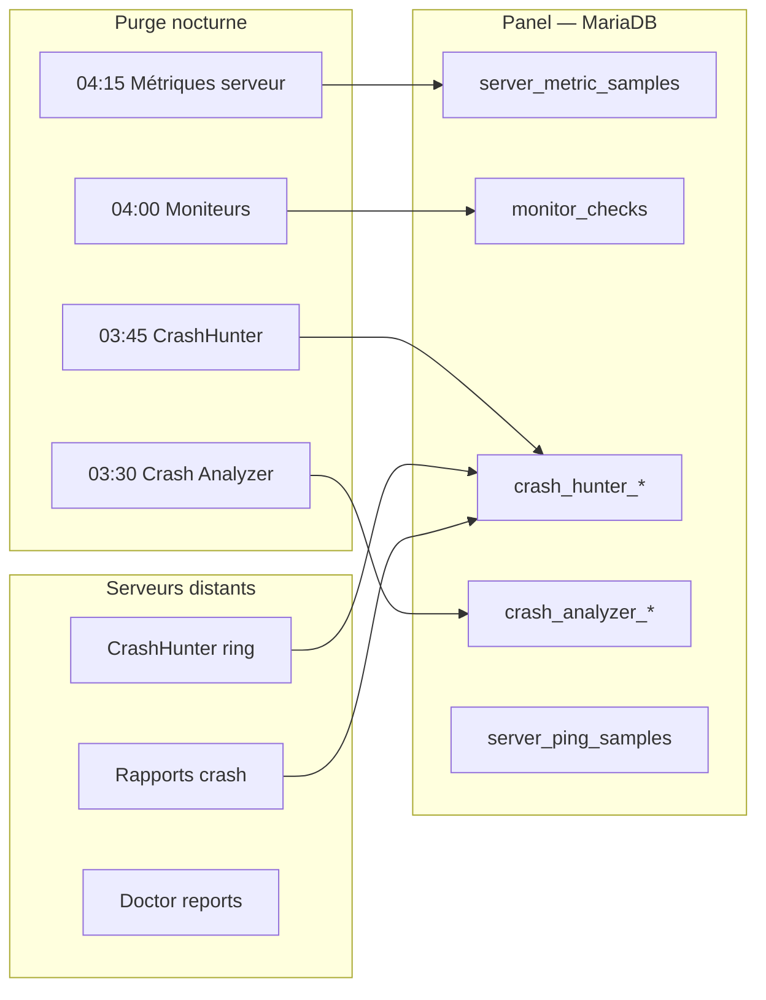

# Rétention et purge — ObiOra Panel

Document de référence pour les **durées de conservation**, les **jobs de purge** et la **configuration** des métriques, logs, traces et rapports — côté **panel (BDD + fichiers)** et côté **agents sur les serveurs**.

> Dernière revue code : v2.7.8 — juillet 2026  
> Fichiers sources : `config/monitoring.php`, `config/crash_hunter.php`, `config/crash_analyzer.php`, `routes/console.php`, jobs `PruneOld*`

---

## Vue d’ensemble



| Couche | Rôle |
|--------|------|
| **Panel BDD** | Historique long terme (graphiques, SLA, flotte) |
| **Jobs `PruneOld*`** | Suppression automatique des données expirées |
| **Agents locaux** | Ring buffer, rapports forensics, logs service |
| **Fichiers panel** | `storage/logs/*` (rotation Monolog) |
| **Redis / cache** | Métriques réseau dashboard (éphémère) |

---

## 1. Panel — base de données (par serveur ou global)

### 1.1 Purge automatique (jobs planifiés)

Le scheduler Laravel (`routes/console.php`) lance ces jobs **chaque nuit** (nécessite `obiora-scheduler.timer` actif).

| Job | Horaire | Table(s) | Rétention défaut | Minimum | Variable `.env` |
|-----|---------|----------|------------------|---------|-----------------|
| `PruneOldMetricsJob` | **03:30** | `crash_analyzer_metrics`, `crash_analyzer_events` | **72 h** | — | `OBIORA_CRASH_RETENTION_HOURS` |
| `PruneOldCrashHunterDataJob` | **03:45** | `crash_hunter_metrics`, `crash_hunter_snapshots`, `crash_hunter_events`, `crash_hunter_witness` | voir détail §1.2 | — | voir §3 |
| `PruneOldMonitorChecksJob` | **04:00** | `monitor_checks` | **60 jours** | 7 j | `OBIORA_MONITOR_CHECK_RETENTION_DAYS` |
| `PruneOldServerPingSamplesJob` | **04:30** | `server_ping_samples` | **60 j** | 7 j | `OBIORA_MONITOR_RETENTION_DAYS` |
| `PruneOldServerMetricSamplesJob` | **04:15** | `server_metric_samples` | **60 jours** | 14 j | `OBIORA_MONITOR_SAMPLE_RETENTION_DAYS` |

**Exceptions importantes (données conservées plus longtemps) :**

- `crash_analyzer_events` et `crash_hunter_events` avec `severity = critical` → **jamais supprimés** par le job de purge.
- `crash_hunter_incidents`, `crash_hunter_reports`, `diagnostic_reports`, `crash_analyzer_reports` → **pas de job de purge** (conservation illimitée en BDD).

### 1.2 Détail CrashHunter (panel BDD)

Config : `config/crash_hunter.php` — implémentation : `CrashHunterMetricsService::pruneOld()`.

| Donnée | Table | Rétention défaut | Variable `.env` |
|--------|-------|------------------|-----------------|
| Métriques time-series | `crash_hunter_metrics` | **72 h** | `CRASH_HUNTER_METRICS_RETENTION_HOURS` |
| Snapshots forensics | `crash_hunter_snapshots` | **24 h** | `CRASH_HUNTER_SNAPSHOT_RETENTION_HOURS` |
| Événements (non critical) | `crash_hunter_events` | **72 h** | (même cutoff que métriques) |
| Witness (heartbeats) | `crash_hunter_witness` | **7 jours** | *(hardcodé)* |
| Incidents | `crash_hunter_incidents` | **Illimité** | — |
| Rapports post-crash | `crash_hunter_reports` | **Illimité** | — |

**Affichage UI** (≠ rétention BDD) : dashboard CrashHunter dans le panel = fenêtre **60 minutes** (`CRASH_HUNTER_HISTORY_MINUTES`).

### 1.3 Détail Crash Analyzer (panel BDD)

Config : `config/crash_analyzer.php`.

| Donnée | Table | Rétention défaut | Variable `.env` |
|--------|-------|------------------|-----------------|
| Métriques | `crash_analyzer_metrics` | **72 h** | `OBIORA_CRASH_RETENTION_HOURS` |
| Événements (non critical) | `crash_analyzer_events` | **72 h** | idem |
| Rapports crash | `crash_analyzer_reports` | **Illimité** | — |

**Affichage UI** : historique graphique **60 min** (`OBIORA_CRASH_HISTORY_MINUTES`).

### 1.4 Monitoring — métriques serveur & moniteurs web

Config : `config/monitoring.php`.

| Donnée | Table | Rétention défaut | Purge auto | Variable `.env` |
|--------|-------|------------------|------------|-----------------|
| CPU / RAM / disque / réseau | `server_metric_samples` | **60 j** | Oui (04:15) | `OBIORA_MONITOR_SAMPLE_RETENTION_DAYS` |
| Checks HTTP / ping / port… | `monitor_checks` | **60 j** | Oui (04:00) | `OBIORA_MONITOR_CHECK_RETENTION_DAYS` |
| Échantillons ping flotte | `server_ping_samples` | **60 j** | Oui (04:30) | `OBIORA_MONITOR_RETENTION_DAYS` |
| Visites sites (compteur) | `monitor_visit_daily` | **Illimité** | **Non** | — |
| Incidents monitoring | `monitoring_incidents` | **Illimité** | **Non** | — |
| Alertes panel | `monitoring_alerts` | **Illimité** | **Non** | — |
| Logs notifications | `notification_logs` | **Illimité** | **Non** | — |

**UI moniteur web** : tableau « Derniers checks » = **200 lignes** max (`OBIORA_MONITOR_RECENT_CHECKS_LIMIT`) — indépendant de la rétention BDD (60 j).

**Variable réservée** : `OBIORA_MONITOR_RETENTION_DAYS=60` est définie dans `config/monitoring.php` mais **n’est pas encore branchée** sur un job (prévu pour ping samples / données flotte).

### 1.5 Doctor & diagnostics

| Donnée | Table | Rétention | Purge auto |
|--------|-------|-----------|------------|
| Rapports Doctor signés | `diagnostic_reports` | **Illimité** | Non |
| Journal déploiement | `deploy_logs` | **Illimité** | Non (UI : 80 dernières lignes / serveur) |

### 1.6 Autres tables panel (hors monitoring strict)

| Donnée | Table | Purge auto | Notes |
|--------|-------|------------|-------|
| Historique MAJ panel | `update_history` | Non | Conservé pour audit |
| Logs provisioning | `provisioning_logs` | Non | — |
| Conversations IA | `ai_conversations`, `ai_messages` | Non | — |
| Sessions Laravel | `sessions` | Expiration session | Config session |
| Cache BDD | `cache` | TTL par clé | Driver `database` ou `redis` |
| Jobs failed | `failed_jobs` | Non | Nettoyage manuel `php artisan queue:flush` |

---

## 2. Panel — fichiers logs

Config : `config/logging.php`.

| Fichier / canal | Driver | Rétention défaut | Variable |
|-----------------|--------|------------------|----------|
| `storage/logs/laravel.log` | `single` ou `daily` | **14 j** si `daily` | `LOG_DAILY_DAYS` |
| `storage/logs/deploy.log` | `daily` | **30 j** | — |
| `storage/logs/provisioning.log` | `daily` | **30 j** | — |

Canal par défaut : `LOG_CHANNEL=stack` → souvent `single` (un seul fichier, **pas de rotation** tant que `LOG_STACK` n’inclut pas `daily`).

**Recommandation production** :

```env
LOG_CHANNEL=stack
LOG_STACK=daily
LOG_DAILY_DAYS=14
```

---

## 3. Panel — cache Redis (métriques réseau dashboard)

Données **non persistées en MariaDB** — clés Redis via `NetworkMetrics` :

| Clé | Contenu | TTL |
|-----|---------|-----|
| `obiora:net:last:{server_id}` | Dernier compteur RX/TX (débit instantané) | **3600 s** |
| `obiora:net:span:{server_id}` | Agrégats heure / jour / mois + **14 jours** d’historique journalier | `forever` (jusqu’à purge Redis ou reset) |

En cas d’indisponibilité Redis au boot : le dashboard fonctionne en mode dégradé (pas d’historique réseau).

---

## 4. Agents sur les serveurs distants

### 4.1 CrashHunter (`/opt/crashhunter`)

Config agent : `config.yaml` ou défauts `ObiOra-Suite/crashhunter/crashhunter/config/default.yaml`.

| Donnée | Emplacement | Rétention défaut | Config |
|--------|-------------|------------------|--------|
| **Ring buffer** (snapshots / traces) | `/dev/shm/crashhunter-ring` + sync disque | **~720 entrées** (~1 h à 5 s/cycle) | `ring.capacity` / dérivé de l’intervalle |
| **Rapports crash** | `{base_dir}/reports/CrashReport_*` | **90 jours** | `retention.retention_days` |
| Compression rapports | idem | Après **7 jours** → `.tar.zst` | `retention.compress_after_days` |
| Witness local (heartbeats) | `data/witness/heartbeats/` | **120 fichiers** / hôte | `WitnessStore._trim_history` |
| Logs service | journald / `{base_dir}/logs` | Rotation systemd | — |
| Push vers panel | API witness + metrics | Intervalle **30 s** | `panel.push_interval_seconds` |

Purge disque agent : daemon CrashHunter (`RetentionManager`) environ **toutes les 720 cycles**.

### 4.2 ObiOra Doctor (`ObiOra-Doctor`)

| Donnée | Rétention défaut | Config |
|--------|------------------|--------|
| Rapports sur disque | **30 jours** | `report_retention_days` (`config/default.json`) |
| Purge CLI | `obiora-doctor clean --days N` | `core/history.py` |

Les rapports **signés** envoyés au panel restent en BDD (`diagnostic_reports`) sans limite.

### 4.3 Crash Analyzer (agent `agent/crash-analyzer`)

| Donnée | Rétention défaut | Config |
|--------|------------------|--------|
| Stockage local (SQLite / fichiers) | **`history_minutes × 60` secondes** (défaut **60 min**) | `OBIORA_CRASH_HISTORY_MINUTES` |
| Purge locale | Daemon `storage.prune_old()` | À chaque cycle si configuré |
| Push panel | Métriques + events | `push_interval_seconds` (défaut 30 s) |

---

## 5. Configuration `.env` — récapitulatif panel

Copier / ajuster dans `/opt/obiora-panel/.env` puis :

```bash
sudo -u obiora php artisan config:clear
```

```env
# ── Monitoring général ──
OBIORA_MONITOR_SAMPLE_RETENTION_DAYS=60
OBIORA_MONITOR_CHECK_RETENTION_DAYS=60
OBIORA_MONITOR_RETENTION_DAYS=60          # réservé — pas encore utilisé par un job
OBIORA_MONITOR_RECENT_CHECKS_LIMIT=200

# ── Crash Analyzer (panel BDD) ──
OBIORA_CRASH_RETENTION_HOURS=72
OBIORA_CRASH_HISTORY_MINUTES=60

# ── CrashHunter (panel BDD + UI) ──
CRASH_HUNTER_METRICS_RETENTION_HOURS=72
CRASH_HUNTER_SNAPSHOT_RETENTION_HOURS=24
CRASH_HUNTER_HISTORY_MINUTES=60
CRASH_HUNTER_WITNESS_TIMEOUT=60
CRASH_HUNTER_WITNESS_DEATH=90
CRASH_HUNTER_WITNESS_STALE=90

# ── Logs panel ──
LOG_CHANNEL=stack
LOG_STACK=daily
LOG_DAILY_DAYS=14
```

---

## 6. Vérifier que les purges tournent

```bash
# Scheduler actif
systemctl status obiora-scheduler.timer

# Dernières exécutions (logs Laravel)
grep -i prune /opt/obiora-panel/storage/logs/laravel.log | tail -20

# Queue worker (jobs PruneOld* passent par la queue)
systemctl status obiora-queue
```

Les jobs sont des `ShouldQueue` : ils nécessitent un worker **`obiora-queue`** actif.

---

## 7. Lacunes connues & évolutions prévues

| Lacune | Impact | Piste |
|--------|--------|-------|
| `server_ping_samples` sans purge | ~~Croissance BDD~~ | ✅ Job `PruneOldServerPingSamplesJob` (v4.0.0) |
| `deploy_logs` sans purge | Croissance BDD | Job > 90 j ou aligné logs fichiers (30 j) |
| `monitor_visit_daily` sans purge | Faible (1 ligne/j/moniteur) | Purge > 365 j |
| `diagnostic_reports` / rapports crash illimités | Croissance BDD long terme | Job configurable par type |
| Pas de commande `artisan obiora:prune` | Purge manuelle difficile | ✅ `obiora:prune --dry-run` (v4.0.0) |

---

## 8. Matrice rapide « combien de temps je garde quoi ? »

| Besoin utilisateur | Où regarder | Durée typique |
|--------------------|-------------|---------------|
| Graphique CPU serveur 30 j | `server_metric_samples` | **60 j** en BDD |
| Uptime site deforest 1 an | Limité par `monitor_checks` | **60 j** max en BDD |
| Witness flotte « mort » | `crash_hunter_witness` | Dernier push ; stale si > **90 s** |
| Forensics freeze kernel | Ring agent + snapshots panel | **~1 h** local + **24 h** snapshots BDD |
| Rapport crash complet | Agent 90 j + BDD panel | **90 j** disque + **∞** si ingéré |
| Rapport Doctor PDF | Disque agent 30 j + BDD | **30 j** local + **∞** panel |
| Journal install agent | `deploy.log` + `deploy_logs` | **30 j** fichier + **∞** BDD |

---

## 9. Références code

| Composant | Fichier |
|-----------|---------|
| Jobs purge | `app/Jobs/PruneOld*.php`, `app/Jobs/CrashHunter/PruneOldCrashHunterDataJob.php` |
| Scheduler | `routes/console.php` |
| Config monitoring | `config/monitoring.php` |
| Config CrashHunter | `config/crash_hunter.php` |
| Config Crash Analyzer | `config/crash_analyzer.php` |
| Purge CrashHunter BDD | `app/Services/CrashHunter/CrashHunterMetricsService.php` |
| Purge Crash Analyzer BDD | `app/Services/CrashAnalyzer/CrashAnalyzerMetricsService.php` |
| Rétention agent CrashHunter | `ObiOra-Suite/crashhunter/crashhunter/storage/retention.py` |
| Rétention agent Doctor | `ObiOra-Doctor/core/history.py` |

---

*Pour toute modification de rétention en production : ajuster `.env`, `config:clear`, surveiller la taille MariaDB (`server_metric_samples`, `monitor_checks`, `crash_hunter_metrics`) après 48 h.*
