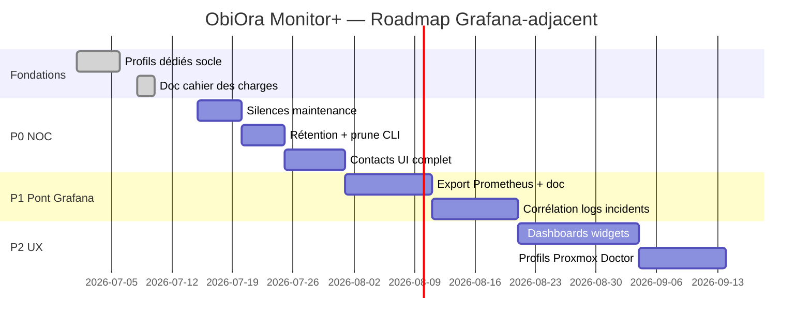

# ObiOra Monitor+ — Cahier des charges & roadmap (vs Grafana)

> **Version document** : juillet 2026  
> **Public** : équipe ObiOra / hébergeurs  
> **Références** : [Grafana Labs](https://grafana.com/), [Dashboards Grafana](https://grafana.com/grafana/dashboards/), docs internes Phases 1–7

---

## 1. Contexte & objectifs

### 1.1 Problème

ObiOra couvre déjà un **panel hébergeur complet** (sites, BDD, Docker, backups, Doctor, Crash) et une couche **Monitor** (moniteurs, incidents, status page, API). Historiquement, une partie du code et de la doc était **orientée Virtualizor** (install KVM, SSH 2212, module Doctor Virtualizor).

**Objectif** : rester **meilleur qu’un Grafana seul pour l’hébergeur**, tout en comblant les trous NOC (contacts, silences, rétention, pont Prometheus) **sans** viser à remplacer [Grafana Cloud](https://grafana.com/) ni son écosystème de dashboards.

### 1.2 Positionnement produit

| Produit | Rôle |
|---------|------|
| **Grafana** | Téléscope universel : métriques, logs, traces, dashboards flexibles, alerting multi-sources, IRM |
| **ObiOra Monitor+** | Cockpit hébergeur : surveiller, alerter, **diagnostiquer (Doctor)**, **comprendre les crash (Crash)**, **agir depuis le panel** |

**Message commercial** :

> Pinguzo / Grafana surveillent. **ObiOra surveille et soigne.**

### 1.3 Principes directeurs

1. **Ne pas remplacer Grafana** — proposer un **pont technique** (export Prometheus + doc d’installation).
2. **Généraliser les dédiés** — profils hôte (`bare_metal`, `virtualizor`, `proxmox`, …) au lieu d’un seul cas Virtualizor.
3. **Réutiliser l’existant** — alert policies, contacts, incidents, agents, rétention documentée ([RETENTION-ET-PURGE.md](./RETENTION-ET-PURGE.md)).
4. **Self-hosted** — pas de SaaS obligatoire ; données chez le client.
5. **Livraisons incrémentales** — lots de 1–2 semaines, critères d’acceptation testables.

---

## 2. Profils hôte dédié (générique)

### 2.1 État livré (socle v2.7.x)

| Composant | Fichier / route | Description |
|-----------|-----------------|-------------|
| Enum profils | `app/Enums/DedicatedHostProfile.php` | `bare_metal`, `virtualizor`, `proxmox`, `solusvm`, `custom`, `auto` |
| Registre | `app/Support/DedicatedHostProfileRegistry.php` | Modules Doctor, alert hints, liens panel par profil |
| Install panel | `install/lib/dedicated-profiles.sh` | Détection auto + hooks par profil |
| Hooks install | `install/lib/profiles/*.sh` | Virtualizor (KVM, SSH 2212), Proxmox (udev KVM), bare metal (neutre) |
| UI serveur | `/servers/create` | Sélecteur « Profil hôte » si type = Dédié |
| Fiche Monitor+ | `/monitoring/servers/{id}` | Affiche le libellé profil |

**Détection auto à l’install** (`OBIORA_HOST_PROFILE=auto`, défaut) :

```
Virtualizor → proxmox → solusvm → bare_metal
```

**Forçage manuel** :

```bash
bash install.sh --host-profile proxmox
# ou
OBIORA_HOST_PROFILE=bare_metal bash install.sh
```

### 2.2 Cahier des charges — profils (suite)

| ID | Exigence | Priorité | Statut |
|----|----------|----------|--------|
| P-01 | Enum + registre profils dédiés | P0 | ✅ Fait |
| P-02 | Install panel multi-profils | P0 | ✅ Fait |
| P-03 | Sélecteur profil à l’ajout serveur | P0 | ✅ Fait |
| P-04 | Édition profil sur fiche serveur existante | P1 | À faire |
| P-05 | Module Doctor Proxmox (ZFS, cluster, CT/VM) | P2 | À faire |
| P-06 | Module Doctor SolusVM | P3 | Backlog |
| P-07 | Détection auto profil côté agent (push metadata) | P2 | À faire |
| P-08 | Politiques d’alerte pré-cochées selon profil | P2 | À faire |
| P-09 | Runbook install par profil dans la doc | P1 | À faire |

### 2.3 Matrice profils

| Profil | Détection install | SSH défaut | KVM udev | Doctor clé | Alertes recommandées |
|--------|-------------------|------------|----------|------------|----------------------|
| **bare_metal** | défaut | 22 | non | disk, raid, smart | CPU, RAM, disk, load |
| **virtualizor** | `/usr/local/virtualizor` | 2212 | oui | virtualizor, kvm | + CPU steal |
| **proxmox** | `/etc/pve`, `pveversion` | 22 | si `/dev/kvm` | cpu, disk, network | + CPU steal |
| **solusvm** | `/usr/local/solusvm` | 22 | oui | générique | + CPU steal |
| **custom** | manuel | 22 | non | standard | standard |

---

## 3. Comparaison ObiOra vs Grafana (rappel)

### 3.1 ObiOra a **en plus**

- Panel hébergeur intégré (sites, MySQL, Docker, SSL, Virtualizor API…)
- Doctor (score 0–100, 25 modules)
- Crash Analyzer + CrashHunter (forensics freeze/OOM/reboot)
- Chaîne incident → Doctor / Crash → actions panel
- Multi-serveur maître + slaves, déploiement agents one-liner
- Status page `/status` intégrée
- Self-hosted sans stack Prometheus+Loki+Tempo obligatoire

### 3.2 ObiOra a **en moins**

- Dashboards libres (milliers de modèles [Grafana dashboards](https://grafana.com/grafana/dashboards/))
- PromQL / LogQL / requêtes ad hoc
- Logs centralisés (Loki), traces (Tempo), APM
- Alerting unifié multi-datasources + OnCall enterprise
- Synthetic monitoring / k6 intégré
- IA observabilité (assistant Grafana)

### 3.3 Stratégie retenue

```
┌─────────────────────────────────────────────────────────────┐
│  ObiOra Monitor+  = NOC hébergeur + Doctor + Crash + actions│
├─────────────────────────────────────────────────────────────┤
│  Option power user : Grafana à côté via export Prometheus   │
└─────────────────────────────────────────────────────────────┘
```

---

## 4. Lots prioritaires (cahier des charges détaillé)

### Lot A — Silences / maintenance (NOC)

**Intérêt** : standard NOC — ne pas alerter pendant une fenêtre de maintenance planifiée.  
**Effort** : faible · **Priorité** : P0 · **Durée** : ~3 j

| Exigence | Détail |
|----------|--------|
| Modèle `maintenance_windows` | `resource_type` (all/server/monitor), `resource_ids`, `starts_at`, `ends_at`, `note`, `created_by` |
| UI | `/monitoring/maintenance` — créer / lister / annuler |
| Moteur | `AlertPolicyEvaluator` et `MonitoringAlertService` ignorent les ressources en maintenance |
| Incidents | Pas de nouvel incident ; incidents ouverts optionnellement auto-résolus à l’ouverture fenêtre |
| API | `POST /api/v1/monitoring/maintenance` |

**Critères d’acceptation** :

- [ ] Créer une fenêtre sur un serveur → plus d’alerte disk pendant la fenêtre
- [ ] Badge « Maintenance » sur fiche serveur et dashboard flotte
- [ ] Test feature + doc utilisateur

---

### Lot B — Rétention configurable + purge UI

**Intérêt** : SLA long terme, maîtrise BDD. Base déjà documentée dans [RETENTION-ET-PURGE.md](./RETENTION-ET-PURGE.md).  
**Effort** : faible · **Priorité** : P0 · **Durée** : ~4 j

| Exigence | Détail |
|----------|--------|
| Job ping samples | `PruneOldServerPingSamplesJob` avec `OBIORA_MONITOR_RETENTION_DAYS` (variable déjà réservée) |
| UI admin | `/monitoring/settings/retention` — afficher durées actuelles + lien doc |
| CLI | `php artisan obiora:prune --dry-run` |
| Purge rapports Doctor (option) | `OBIORA_DOCTOR_REPORT_RETENTION_DAYS` (0 = illimité) |

**Critères d’acceptation** :

- [ ] `OBIORA_MONITOR_RETENTION_DAYS=90` purge `server_ping_samples` > 90 j
- [ ] `--dry-run` liste les volumes sans supprimer
- [ ] Doc RETENTION-ET-PURGE.md mise à jour

---

### Lot C — Contacts UI (Slack, Discord, Telegram, webhook)

**Intérêt** : parité alerting Grafana / Pinguzo. Modèle `AlertContact` **existe déjà**.  
**Effort** : faible–moyen · **Priorité** : P0 · **Durée** : ~5 j

| Exigence | Détail |
|----------|--------|
| UI complète | `/monitoring/alerts/contacts` — CRUD, test notification |
| Canaux | email, slack_webhook, discord_webhook, telegram (bot+chat), webhook_url générique |
| Logs | `/monitoring/alerts/notifications` — historique `notification_logs` |
| Lien policies | Sélection contacts sur chaque `AlertPolicy` (déjà en BDD) |
| Test | Bouton « Envoyer test » par contact |

**Critères d’acceptation** :

- [ ] Incident Monitor Down → Slack reçu en < 2 min
- [ ] Échec webhook loggé avec statut HTTP
- [ ] Spec Phase 5 ([PHASE-5-alertes-incidents.md](./PHASE-5-alertes-incidents.md)) cochée contacts

---

### Lot D — Export Prometheus

**Intérêt** : brancher [Grafana](https://grafana.com/) ou Datadog sans dupliquer la collecte ObiOra.  
**Effort** : moyen · **Priorité** : P1 · **Durée** : ~1 sem

| Exigence | Détail |
|----------|--------|
| Endpoint | `GET /metrics` (format Prometheus text) ou `/api/v1/monitoring/prometheus` |
| Auth | Token Bearer ou IP allowlist (config `.env`) |
| Métriques exposées | `obiora_server_cpu_percent`, `obiora_server_memory_percent`, `obiora_server_disk_percent`, `obiora_monitor_up`, `obiora_server_up`, `obiora_doctor_score`, labels `server_id`, `server_name` |
| Doc | `docs/monitoring/GRAFANA-PONT.md` — install Grafana OSS + datasource Prometheus + dashboard import |
| Option agent | CrashHunter a déjà un export Prometheus optionnel — aligner naming |

**Critères d’acceptation** :

- [ ] `curl -H "Authorization: Bearer …" https://panel/metrics` retourne `# HELP obiora_server_cpu_percent`
- [ ] Grafana scrape OK + 1 dashboard minimal fourni (JSON)
- [ ] Pas de fuite de secrets dans les labels

**Hors scope v1** : remote write, federation multi-panel.

---

### Lot E — Corrélation logs (incident)

**Intérêt** : pont « logs » sans Loki — contexte immédiat dans la fiche incident.  
**Effort** : moyen · **Priorité** : P1 · **Durée** : ~1 sem

| Exigence | Détail |
|----------|--------|
| Collecte à la volée | Sur incident serveur : agent ou SSH récupère N dernières lignes nginx, php-fpm, mysql (configurable) |
| Stockage | `monitoring_incidents.metadata.log_snippet` (JSON, max 32 Ko) |
| UI | Bloc « Logs récents » sur `/monitoring/incidents/{id}` |
| Déclencheurs | disk, monitor down, server offline, high load |
| Sécurité | Masquer tokens / mots de passe ; timeout 10 s |

**Critères d’acceptation** :

- [ ] Incident « High disk » affiche extrait `/var/log/nginx/error.log` si présent
- [ ] Échec SSH → message explicite, pas de blocage incident

---

### Lot F — Dashboards personnalisables (sans PromQL)

**Intérêt** : UX type Grafana (widgets, presets temps) sans moteur de requêtes complet.  
**Effort** : moyen · **Priorité** : P2 · **Durée** : ~2 sem

| Exigence | Détail |
|----------|--------|
| Modèle | `monitoring_dashboards` — layout JSON (grid), owner user, preset public/privé |
| Widgets v1 | cpu_chart, memory_chart, disk_chart, ping_sparkline, incidents_list, doctor_score, monitor_uptime |
| Presets temps | 1h, 6h, 24h, 7j, 30j (comme pages métriques actuelles) |
| UI | `/monitoring/dashboards` — éditeur drag-and-drop léger (GridStack ou similaire) |
| Défaut | Dashboard flotte inchangé ; custom en onglet « Mes tableaux » |

**Critères d’acceptation** :

- [ ] Créer dashboard perso avec 3 widgets, sauvegarder, rouvrir
- [ ] Export/import JSON layout
- [ ] Pas de régression dashboard flotte existant

---

## 5. Roadmap proposée

### Vue calendrier (12 semaines)



### Sprints détaillés

| Sprint | Semaine | Livrables | Version cible |
|--------|---------|-----------|---------------|
| **S0** | En cours | Profils dédiés + ce document | v2.7.20 |
| **S1** | S+1 | Lot A (maintenance) + Lot B (rétention ping + CLI prune) | v2.8.0 |
| **S2** | S+2 | Lot C (contacts UI + logs notifications) | v2.8.1 |
| **S3** | S+3–4 | Lot D (Prometheus + `GRAFANA-PONT.md`) | v2.8.2 |
| **S4** | S+5–6 | Lot E (logs incident) + P-04 édition profil serveur | v2.8.3 |
| **S5** | S+7–9 | Lot F (dashboards widgets v1) | v2.9.0 |
| **S6** | S+10+ | P-05 Doctor Proxmox, P-07 détection agent | v2.9.x |

---

## 6. Ce qu’il vaut mieux **ne pas** installer / développer

| Idée | Pourquoi éviter |
|------|-----------------|
| Replique complète Grafana (PromQL, 1000 dashboards) | Coût énorme, Grafana OSS fait déjà le job |
| Loki + Tempo embarqués dans le panel | Stack lourde, hors cœur hébergeur |
| k6 / load testing intégré | Produit à part ; lien doc suffit |
| IA « build dashboard » | ROI faible vs contacts + silences + Prometheus |
| Rip-and-replace Pinguzo agent | Propriétaire ; agents ObiOra suffisent |

**Recommandation install client** :

| Besoin | Installer |
|--------|-----------|
| NOC hébergeur + actions | **ObiOra seul** (déjà) |
| Dashboards avancés / PromQL | **Grafana OSS** à côté + scrape `/metrics` ObiOra |
| Logs long terme | **Loki** ou stack existante client — pas dans ObiOra v1 |
| On-call enterprise | Webhooks ObiOra → PagerDuty/Opsgenie via Lot C |

---

## 7. Pont Grafana — guide rapide (à formaliser Lot D)

Document cible : `docs/monitoring/GRAFANA-PONT.md`

```bash
# 1. Activer export ObiOra
OBIORA_PROMETHEUS_ENABLED=true
OBIORA_PROMETHEUS_TOKEN=…

# 2. Grafana OSS (Docker exemple)
docker run -d -p 3000:3000 grafana/grafana

# 3. Datasource Prometheus → URL panel /metrics + Bearer token
# 4. Importer dashboard minimal obiora-fleet.json
```

Références : [Grafana](https://grafana.com/), [Dashboard templates](https://grafana.com/grafana/dashboards/).

---

## 8. Dépendances & risques

| Risque | Mitigation |
|--------|------------|
| Croissance BDD ping samples | Lot B en S1 |
| Bruit alertes OOM / offline | Intelligence alertes Phase 7 + silences Lot A |
| Profil mal choisi à l’install | `--host-profile` + détection auto + édition P-04 |
| Export Prometheus = fuite données | Auth token, rate limit, pas de tokens agent en labels |
| Scope creep « remplacer Grafana » | Ce document + revue sprint |

---

## 9. Métriques de succès

| KPI | Cible 3 mois |
|-----|--------------|
| MTTR incident disk | −30 % (logs + Doctor 1 clic) |
| Faux positifs maintenance | −80 % (silences) |
| Adoption contacts Slack/Telegram | > 1 contact actif / install prod |
| Clients avec Grafana + ObiOra | ≥ 1 doc + dashboard minimal |
| Serveurs dédiés non-Virtualizor | Profil explicite sur 100 % des dédiés |

---

## 10. Références internes

| Document | Lien |
|----------|------|
| Phases Monitor 1–7 | [README.md](./README.md) |
| Rétention & purge | [RETENTION-ET-PURGE.md](./RETENTION-ET-PURGE.md) |
| Alertes Phase 5 | [PHASE-5-alertes-incidents.md](./PHASE-5-alertes-incidents.md) |
| Monitor vs Doctor vs Crash | [MONITOR-VS-DOCTOR-VS-CRASH.md](./MONITOR-VS-DOCTOR-VS-CRASH.md) |
| Différenciation Phase 7 | [PHASE-7-plus-obiora.md](./PHASE-7-plus-obiora.md) |
| Code profils dédiés | `app/Support/DedicatedHostProfileRegistry.php`, `install/lib/dedicated-profiles.sh` |

---

## 11. Prochaine action recommandée

1. **Valider cette roadmap** (ordre S1 → S2 → S3).
2. **Merger le socle profils dédiés** (v2.7.20) si OK.
3. **Démarrer S1** : silences maintenance + purge ping + `obiora:prune --dry-run`.

---

*Document maintenu avec le code — mettre à jour à chaque lot livré.*
